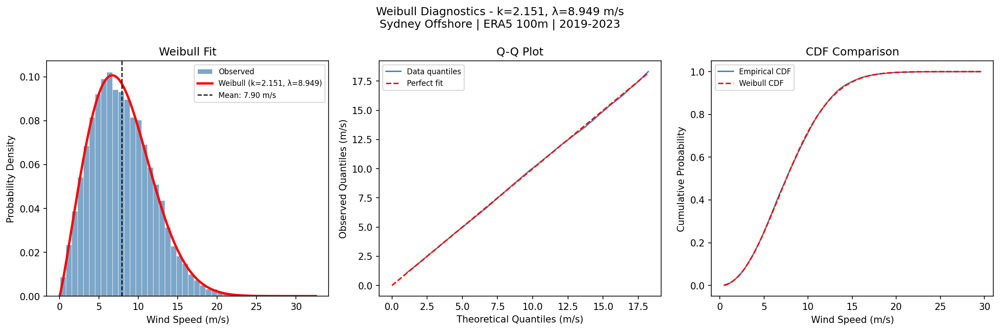
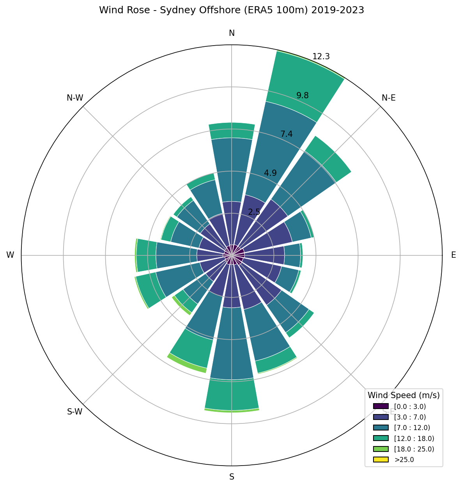
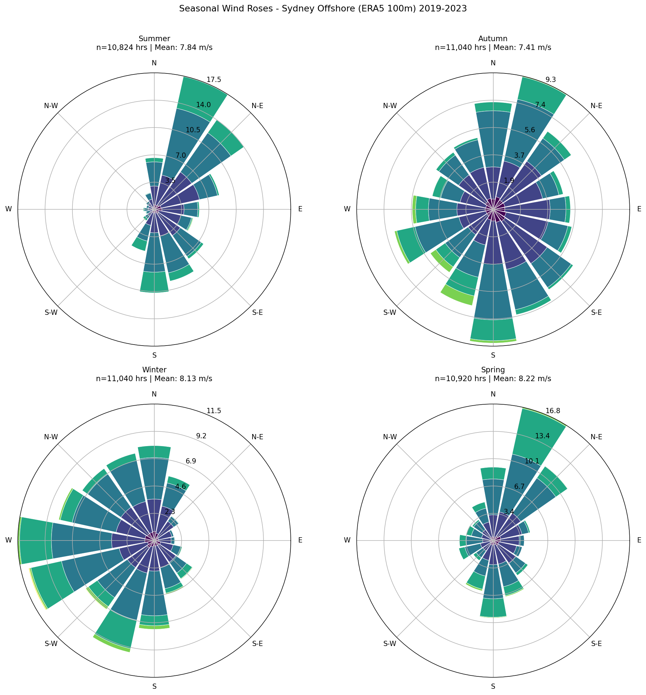
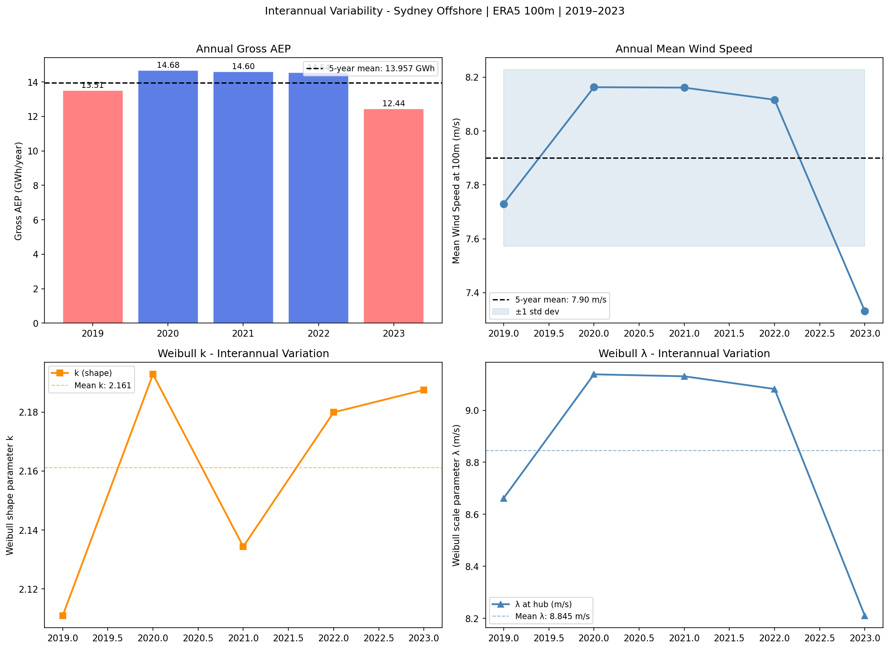
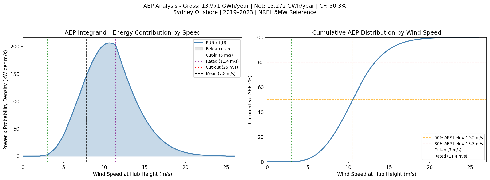

# Wind Resource Analysis - Sydney Offshore

A Python-based wind resource assessment tool replicating the core 
statistical pipeline used in pre-feasibility wind energy studies. 
Ingests ERA5 reanalysis data, fits a Weibull distribution, generates 
wind rose plots, and estimates Annual Energy Production (AEP) for an 
NREL 5MW reference turbine at an offshore Sydney site.

Built as a portfolio project to demonstrate applied wind energy 
engineering and data analysis capabilities in Python.

## Industry Context

Wind resource assessment is a critical early stage in wind farm project development. Before committing capital to turbine procurement, grid connection studies, or environmental impact assessments, developers require a statistically credible characterisation of the wind resource at a target site. This pre-feasibility assessment determines whether a site warrants further investment.

In professional practice this pipeline is handled by commercial tools such as WindPro and WAsP. These platforms ingest long-term reanalysis data, most commonly ERA5, fit statistical wind distributions, generate wind roses, and produce energy yield estimates that form the basis of bankable feasibility reports. The goal of this project was to replicate this pipeline in Python, from ERA5 data extraction, weibull fitting using MLE, and numerical AEP integration. The same Weibull parameters, hub height 
corrections, and power curve convolution that this code computes manually are the inputs WindPro uses to generate its energy yield reports.

The methodology is intentionally kept at pre-feasibility scope. A production assessment would additionally apply terrain corrections, long-term wind speed adjustments, turbulence intensity analysis, and array wake modelling. These steps are noted in the limitations section. It is also noted that the location selected for analysis is in no way being suggested for an ideal location.

## Methodology

The analysis follows a standard wind resource assessment pipeline:

**1. Data Acquisition**
Hourly 100m wind components (u, v) extracted from the ERA5 reanalysis dataset for a five year period (2019–2023) at an offshore Sydney grid point (-34.0°N, 151.75°E). ERA5 was selected as it provides the longest publicly available, physically consistent hourly wind record at near-hub height without requiring instrumentation.

**2. Wind Speed and Direction Derivation**
Scalar wind speed and meteorological wind direction derived from u/v components. Direction converted from mathematical to meteorological convention (clockwise from north, direction wind comes from).

**3. Weibull Distribution Fitting**
A two-parameter Weibull distribution fitted to the combined five-year wind speed dataset using Maximum Likelihood Estimation (MLE) with a fixed location parameter (floc=0). MLE was selected over method of moments for its statistical efficiency at large sample sizes. Goodness of fit assessed via Kolmogorov-Smirnov test and Q-Q plot.

**4. Hub Height Correction**
ERA5 100m wind speeds extrapolated to NREL 5MW hub height (90m) using the power law profile with an offshore shear exponent of α=0.11. Correction applied directly to the Weibull scale parameter λ, which scales linearly with wind speed.

**5. Wind Rose and Directional Analysis**
Directional frequency and mean speed computed across 16 compass sectors (22.5° width). Energy flux per sector calculated using U³ 
weighting to identify the dominant energy direction, which differs from the most frequent direction due to the cubic power relationship.

**6. AEP Estimation**
Annual Energy Production estimated by numerically integrating the product of the NREL 5MW reference turbine power curve and the fitted Weibull PDF using Simpson's rule. A 95% availability factor applied to derive net AEP. Wake losses and electrical losses not modelled.

---

### Pipeline Summary

```
ERA5 CDS API 
→ u/v extraction 
→ wind speed/direction derivation
→ Weibull MLE fit 
→ hub height correction 
→ wind rose
→ power curve convolution 
→ AEP integration 
→ results
```

## Results

### Site and Resource Characterisation

| Parameter | Value |
|---|---|
| Site | Sydney Offshore (-34.0°N, 151.75°E) |
| Data period | 2019–2023 (43,824 hourly observations) |
| Mean wind speed (100m) | 7.90 m/s |
| Mean wind speed (hub, 90m) | 7.83 m/s |
| Weibull shape parameter k | 2.151 |
| Weibull scale parameter λ | 8.949 m/s (100m) / 8.846 m/s (90m) |
| Weibull theoretical mean | 7.925 m/s (100m) / 7.834 m/s (90m) |
| Dominant energy direction | NNE (16.5% of energy flux) |

---

### Wind Speed Distribution

The five-year wind speed dataset fitted with a two-parameter Weibull distribution (k=2.151, λ=8.949 m/s at 100m) using Maximum Likelihood Estimation. The KS test cannot reject the Weibull hypothesis (D=0.006, p=0.092), confirming the distribution is a statistically acceptable characterisation of the long-term wind regime. The Q-Q plot confirms close agreement across the full speed range with minor deviation at the distribution tails, physically consistent with 
the known behaviour of ERA5 area-averaging at mid-latitude offshore sites.



---

### Wind Rose: 2019–2023

The dominant wind direction is NNE, consistent with persistent subtropical high pressure systems driving onshore flow from the Coral Sea. A secondary southwesterly signal is visible in the winter months, driven by Southern Ocean westerly systems. The seasonal roses reveal a clear directional shift between summer (NNE dominant) and winter (westerly influence increases).





---

### Interannual Variability

Annual AEP varied between 12.44 and 14.68 GWh over the five year period, with a coefficient of variation of 6.2%. The anomalously low 2023 result highlights the importance of multi-year averaging for robust resource characterisation, a single year estimate carries meaningful uncertainty.



---

### AEP Estimate

| Parameter | Value |
|---|---|
| Turbine | NREL 5MW Reference |
| Hub height | 90m |
| Gross AEP | 13.971 GWh/year |
| Net AEP (95% availability) | 13.272 GWh/year |
| Gross capacity factor | 31.9% |
| Net capacity factor | 30.3% |
| Availability factor | 95% |
| Wake losses | Not modelled |
| Electrical losses | Not modelled |

The AEP integrand plot below shows the energy contribution at each wind speed. The peak energy contribution occurs around 10–11 m/s - above the mean wind speed of 7.83 m/s - due to the cubic relationship between wind speed and power. 50% of annual energy is generated below 10.5 m/s and 80% below 13.3 m/s, confirming that the bulk of energy production occurs well within the turbine's operational envelope.



## Limitations and Assumptions

The following limitations should be considered when interpreting results. They are consistent with pre-feasibility scope and do not invalidate the methodology, they define where it sits in the broader assessment workflow.

**ERA5 Mesoscale Resolution:**
ERA5 has a native horizontal resolution of ~31km. Each grid point represents an area-averaged atmospheric state, not a point 
measurement. Local terrain effects are not resolved. In professional practice, ERA5 is used as a mesoscale boundary condition 
for higher-resolution downscaling via WAsP, WindPro, or CFD. This project uses ERA5 directly without downscaling.

**Vertical Extrapolation:**
Wind speeds extrapolated from 100m to 90m hub height using the power law with a fixed offshore shear exponent of α=0.11. The power law assumes a neutral atmospheric stability profile. In reality, shear varies with atmospheric stability, time of day, and season.

**Two-Parameter Weibull:**
The standard two-parameter Weibull distribution is the industry convention for wind speed characterisation and is used in WindPro 
and WAsP. It provides a good fit to the bulk of the distribution but slightly underestimates the frequency of near-calm conditions and the weight of the upper tail at this mid-latitude offshore site - both physically attributable to the mixture of synoptic and sea breeze regimes at this location.

**Single Turbine - No Wake Losses:**
AEP is estimated for a single isolated turbine and so array wake losses are not modelled. A production assessment would apply wake modelling using the Jensen, Gaussian, or full CFD approach depending on array complexity.

**Availability and Loss Factors:**
A flat 95% availability factor is applied. Electrical transmission losses, turbine performance degradation, curtailment, and icing losses are not modelled. A full energy yield assessment would quantify each loss category individually.

**Power Curve:**
The NREL 5MW reference turbine power curve is used as published in Jonkman et al. (2009). This is a research reference turbine rather than a commercial product. Air density corrections and turbulence intensity effects on power output are not applied.

**Single Site:**
Analysis is conducted at a single ERA5 grid point. Results are representative of the selected offshore location only and should not be interpreted as a site recommendation or a regional resource characterisation.

## Reproducing the Analysis

### Prerequisites
- Python 3.11+
- A free Copernicus CDS account and API key: 
  https://cds.climate.copernicus.eu

### Installation

Clone the repository and install dependencies:

```bash
git clone https://github.com/aidanw-png/wind-resource-analysis.git
cd wind-resource-analysis
python -m venv .venv
.venv\Scripts\activate        # Windows
source .venv/bin/activate     # macOS/Linux
pip install -r requirements.txt
```

### CDS API Configuration

Create a credentials file at `~/.cdsapirc`:

Accept the ERA5 licence at:
https://cds.climate.copernicus.eu/datasets/reanalysis-era5-single-levels?tab=download#manage-licences

### Download ERA5 Data

Run the download cells in `notebooks/01_era5_exploration.ipynb`. 
Data will be saved to `data/raw/`. Downloads are skipped 
automatically if files already exist.

Expected download size: ~50–100 MB per year (5 files total).
Expected download time: 15–60 minutes depending on CDS queue.

### Run the Analysis

Open `notebooks/02_full_analysis.ipynb` and run all cells in order.
All outputs are saved to `outputs/figures/`.

Site coordinates, turbine parameters, and file paths are configured 
in `config.yaml` — modify this file to run the analysis for a 
different location or turbine without editing source code.

## References

- Jonkman, J. et al. (2009). *Definition of a 5-MW Reference Wind Turbine for Offshore System Development*. NREL Technical Report NREL/TP-500-38060. National Renewable Energy Laboratory.https://www.nrel.gov/docs/fy09osti/38060.pdf

## Author

**Aidan Winning**
MEng Aero-Mechanical Engineering - University of Strathclyde,
Peer-reviewed publication in the Journal of Wind Engineering
